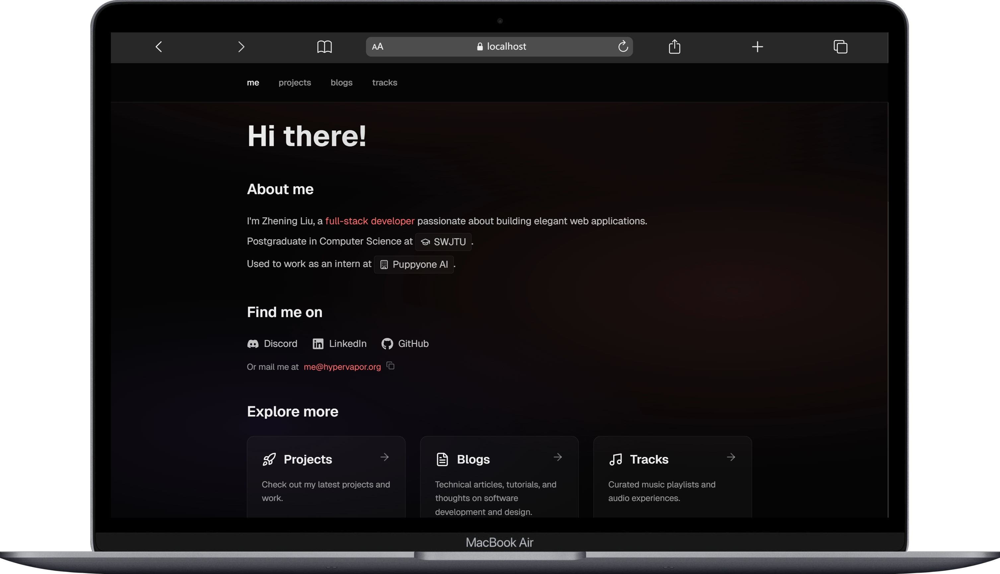
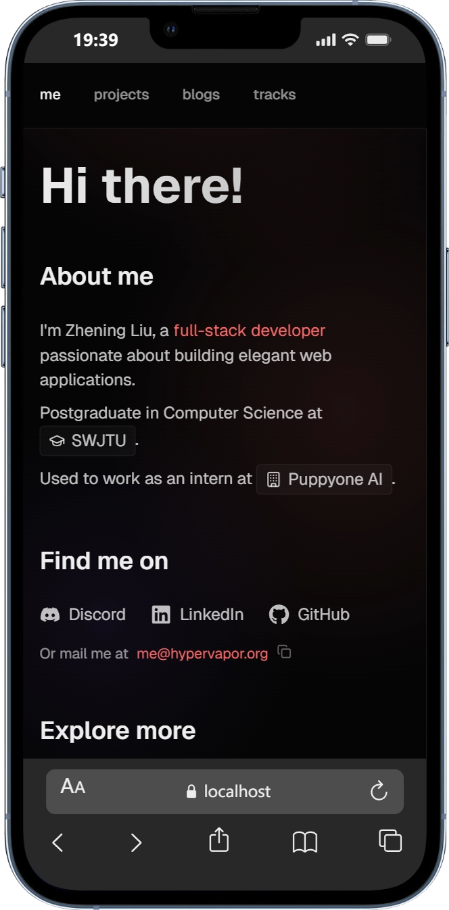

<div align="center">

# Personal Website

A modern personal portfolio website featuring a blog, music player, and developer profile.

[](https://nextjs.org/)
[](https://react.dev/)
[](https://www.typescriptlang.org/)
[](https://tailwindcss.com/)

[](https://opensource.org/licenses/MIT)
[](https://github.com/HYPERVAPOR/me/stargazers)
[](https://github.com/HYPERVAPOR/me/issues)
[](https://github.com/HYPERVAPOR/me/pulls)

[](https://vercel.com)
[](https://github.com/HYPERVAPOR/me)
[](https://github.com/HYPERVAPOR/me)

[](https://github.com/HYPERVAPOR/me)

</div>

## 📸 Screenshots

### Desktop View
<p align="center">
  
</p>

### Mobile View
<p align="center">
  
</p>

## ✨ Features

- **Profile Page** (`/me`) - Professional introduction with contact information
- **Blog** (`/blogs`) - Technical articles with bilingual support (English/Chinese)
- **Music Player** (`/tracks`) - Full-featured music player with playlist and lyrics
- **i18n** - Automatic language detection with manual toggle support

## 🛠️ Tech Stack

| Technology | Version |
|------------|---------|
| [Next.js](https://nextjs.org/) | 16.2.1 |
| [React](https://react.dev/) | 19.2.4 |
| [TypeScript](https://www.typescriptlang.org/) | 5 |
| [Tailwind CSS](https://tailwindcss.com/) | 4 |

## 🚀 Development

```bash
# Install dependencies
pnpm install

# Start development server
pnpm dev

# Build for production
pnpm build

# Start production server
pnpm start
```

## 🌐 Deployment

This project is deployed on [Vercel](https://vercel.com/).

## 📬 Contact

- **Email:** [me@hypervapor.org](mailto:me@hypervapor.org)
- **GitHub:** [HYPERVAPOR](https://github.com/HYPERVAPOR)
- **LinkedIn:** [Zhening Liu](https://linkedin.com/in/zhening-liu-0a2b79364)
